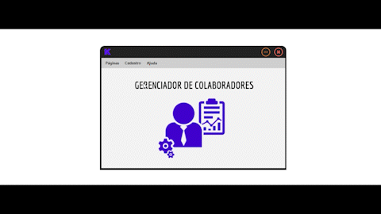
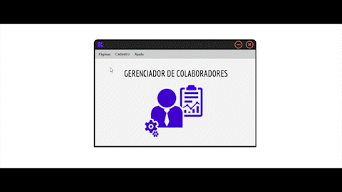
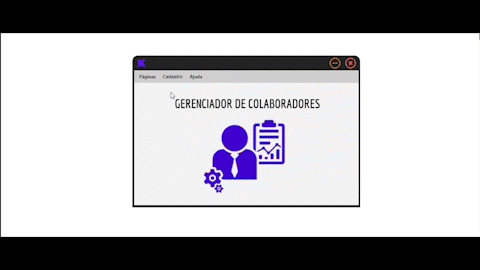
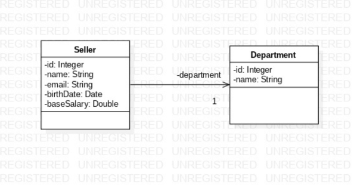

  <h1>Imagens da aplicação</h1>
  <table style="display: inline-table;">
    <tr>
      <td align="center"></td>
      <td align="center">Departamentos</td>
      <td align="center">Vendedores(as)</td>
    </tr>
  </table>

 
<h4>
    Do ponto de vista do usuário, trate-se de um sistema de gerenciamento que permite visualizar e gerenciar informações detalhadas de funcionários e departamentos. 
    Com acesso a um banco de dados, ela oferece uma maneira eficiente de armazenar e manipular dados relacionados a funcionários e departamentos. 
    Essa aplicação por exemplo, seria ideal para atender às necessidades do setor de Recursos Humanos, a aplicação fornece recursos avançados para lidar com um grande 
    volume de informações, facilitando a manutenção e atualização dos dados.
      
    Do ponto de vista técnico, o projeto consiste em um CRUD para o gerenciamento de vendedores e departamentos com acesso ao banco de dados relacional, através de tabelas e colunas. 
    No entanto, além disso, a aplicação também incorpora o conceito de tratamento de eventos. Isso significa que a tabela exibe informações atualizadas em tempo real durante a execução do programa. 
    Os formulários são tratados como eventos e observados pela tabela, tanto para a entidade de departamento quanto para a de vendedores.
      
    Todos os eventos são desenvolvidos com regras de validação, como as tabelas de edição e deleção, assim como os formulários de cadastro e edição. 
    Eles seguem as regras de negócio da aplicação, garantindo que todos os campos sejam preenchidos corretamente. 
    Caso algum campo seja deixado em branco, o sistema exibirá mensagens de erro e não permitirá o cadastro ou a edição até que todas as informações necessárias sejam fornecidas. 
    Esse tratamento de exceções assegura a integridade dos dados e evita erros durante o processo de inserção ou atualização.
      
    Mas o que significa observar esses eventos? Basicamente, a observação dos eventos garante a atualização de todos os campos, como as tabelas e os formulários de cadastro e edição. 
    Para ilustrar, se um novo departamento é cadastrado, quando você for cadastrar um novo vendedor, esse novo departamento estará disponível para seleção. 
    Esse mecanismo segue o padrão de design conhecido como Observer, em que as alterações em um objeto são notificadas e refletidas em outros objetos que estão observando.
      
    Essa abordagem técnica traz uma dinâmica eficiente para a aplicação, garantindo que as informações sejam sincronizadas e atualizadas em tempo real.
</h4>
 

<h2 align="center">Tecnologias Usadas</h2>
   
    <h4 align="center"> 
      

       
       Java
       
       CSS3
       
       MySQL Database
       

   </h4>

 

    <h2 align="center">UML</h2>
        

          
        

    <h3> Destrinchando a estrutura: </h3>

🔹 `Seller`: Entidade que representa um vendedor ou vendedora e armazena informações como nome, e-mail, data de nascimento, salário e o departamento ao qual ele pertence.

🔹 `Department`: Entidade que representa um departamento ou setor da empresa e coleta informações básicas, como um número de identificação único e o nome do departamento.

- `1`: Expressão utilizada para demonstrar uma 'dependência' ou associação entre as entidades, que neste caso trata-se de que um `Seller` deve ter **1** `- department`. 

> Com essa dependência entre as classes, é garantido que não seja possível excluir um departamento que tenha um vendedor associado. No entanto, é possível excluir um vendedor que esteja associado a um departamento, uma vez que a entidade `Department` é independente. Da mesma forma, não é possível cadastrar um vendedor sem um `- department` associado.

 

  <h2 align="center">Instruções de Execução</h2>

  <h4>Requisitos:</h4>
  

    🔹
     Java 8 ou superior instalado no sistema.
  

  

    🔹
    FX instalado e configurado corretamente.
  

   
  

    <strong>Passo 1:</strong> Definir o caminho do módulo do JavaFX SDK.
  

  <pre>
    <code>--module-path /path/to/javafx-sdk-VERSION/lib</code>
  </pre>

  

    <strong>Passo 2:</strong> Adicionar os módulos do JavaFX.
  

  <pre>
    <code>--add-modules javafx.controls,javafx.fxml</code>
  </pre>

  

    <strong>Passo 3:</strong> Executar o arquivo JAR.
  

  <pre>
    <code>-jar sales_mgmt.jar</code>
  </pre>

